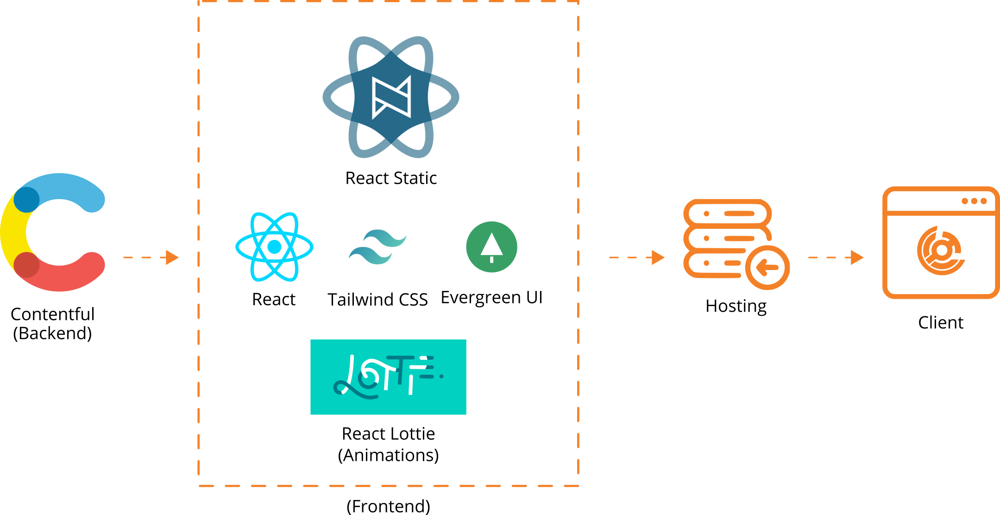

# CICT Online
> Source code of the CICT official website.

### Preview
* Staging [link](https://cictonline.herokuapp.com/) 
* Release [link](http://cictwvsu.com/)

## CICTzens!
Help us develop our website! If you found a bug or you want to contribute, please submit an [issue](https://help.github.com/articles/creating-an-issue/), contact the faculty or email your concern at [cict@wvsu.edu.ph](cict@wvsu.edu.ph). Student contributions are welcome!

## Contributing
Contributing to the code will require you to use a GitHub account and knowledge of using Git. Please visit this [git tutorial](https://try.github.io/levels/1/challenges/1) to learn more.

## Todo
- [ ] Add After Effects animation to the line arts utilizing Lottie.
- [ ] Connect frontend to Contentful.
- [ ] Improve page responsiveness.
- [ ] About Page
- [ ] Students Page (Student's Works)
- [ ] Admission Page
- [ ] Faculty & Staff Page
- [ ] Tools and Resources Page
- [ ] Omni Updates Section (Medium Blog, Facebook, Twitter)
- [ ] Footer Section
- [ ] Credits in About Page
- [ ] Integrate Tracer Study App

## Architecture

## Contributors
We specially want to recognize the following for helping us develop our website
* Regin C. Cabacas - Hosting & Domain Manager
* Link.exe - Photos & Videos

## License
&copy; 2016-Present, College of Information and Communications Technology, West Visayas State University. Licensed under an [Apache-2](https://github.com/wvsu-cict-code/cict-online/blob/master/LICENSE) license.

